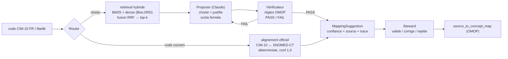
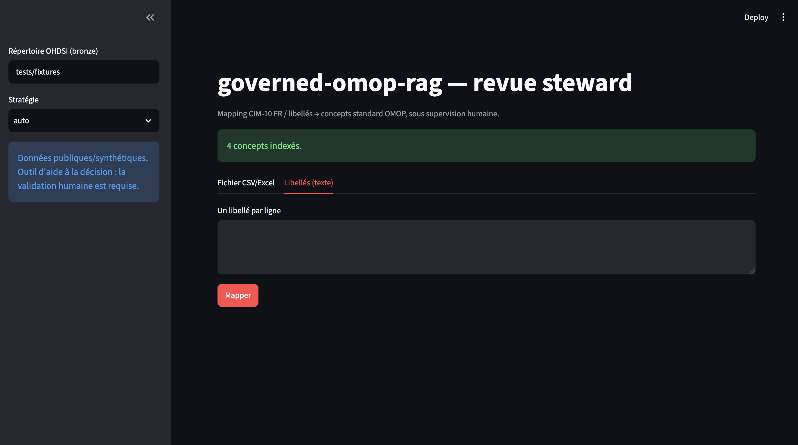

# governed-omop-rag

> **RAG agentique gouverné** pour le mapping de terminologies FR (**CIM-10 FR**,
> libellés cliniques) vers les **concepts standard OHDSI** (OMOP CDM), sous
> **supervision humaine** (human-in-the-loop).

[](https://github.com/behramkorkut/governed-omop-rag/actions/workflows/ci.yml)


> **Statut : Phase 5/6 — fonctionnel de bout en bout.** Corpus médaillon, retrieval
> hybride (BM25 + dense), router déterministe + RAG agentique gouverné (Proposer +
> Vérificateur, LangGraph), API REST, UI Streamlit de revue steward, évaluation
> mesurable, feedback. Benchmark sur gold set réel (données ATIH) et démo hébergée
> en cours. Suivi phase par phase : [`feature_list.json`](feature_list.json).

---

## Le problème

Un Entrepôt de Données de Santé français reçoit des codes en nomenclatures locales
(CIM-10 FR / ATIH, CCAM, NABM…) ou en texte libre. Pour faire de la recherche
reproductible multicentrique, il faut les **traduire vers les vocabulaires standard
OHDSI** (SNOMED-CT, RxNorm, LOINC…). Ce mapping est aujourd'hui **manuel et coûteux** ;
l'outil de référence (Usagi) fait du string-matching limité (~44 % sur certains cas).

## L'approche — hybride & gouvernée



On n'utilise l'IA **que là où elle apporte** : match officiel d'abord (gratuit,
fiable), RAG agentique **uniquement sur le résidu** (coût borné). L'agent
**propose**, le steward **dispose**. Sortie fermée = anti-hallucination structurel.

## Aperçu (UI de revue steward)



_L'UI Streamlit permet d'importer un fichier CSV/Excel, de visualiser les suggestions justifiées (score, source, candidats), et d'accepter / corriger / rejeter chaque ligne. Voir le [guide utilisateur](docs/guide_utilisateur.md)._

> 📸 _Lancez `gor ui` pour l'écran de revue (import CSV/Excel, suggestions
> justifiées, accepter/corriger/rejeter, export). Voir le
> [guide utilisateur](docs/guide_utilisateur.md). Capture : ._

## Ce que ça démontre

- **RAG appliqué** : retrieval hybride (BM25 + embeddings biomédicaux) + fusion RRF,
  cache, évaluation `recall@k`.
- **Agents gouvernés** (principes Anthropic) : multi-agent **seulement là où
  justifié** (spécialisation + vérification), sortie fermée, boucle de correction
  bornée, context engineering.
- **Ingénierie data** : corpus **médaillon Bronze → Silver → Gold** (DuckDB).
- **Évaluation rigoureuse** : Top-1/recall@k, couverture, coût (tokens) & latence,
  baseline reproductible (proxy Usagi). « On ne dit pas que c'est mieux, on le mesure. »
- **Conformité & souveraineté** : embeddings locaux, Qdrant européen, IA Act,
  human-in-the-loop, données synthétiques.
- **Produit** : deux portes d'entrée (API REST + UI non-dev), packaging Docker, CI.

## État des lieux

| Domaine | Statut |
|---|---|
| Corpus médaillon (Bronze/Silver/Gold, DuckDB) | ✅ |
| Retrieval hybride (BM25 + dense + RRF) + cache | ✅ |
| Router déterministe (alignement officiel) + RAG sur résidu | ✅ |
| Agents Proposer + Vérificateur (garde-fous, boucle bornée) | ✅ |
| Orchestration LangGraph (interchangeable) | ✅ |
| API REST (FastAPI) + UI steward (Streamlit) | ✅ |
| Export `source_to_concept_map` + feedback steward | ✅ |
| Évaluation (Top-k, couverture, coût/latence, baseline) | ✅ |
| Docs (architecture, gouvernance, souveraineté, IA Act) | ✅ |
| Gold set **réel** (ATIH) + benchmark chiffré | ⏳ (données à fournir) |
| Expansion de requête · reranking cross-encoder | ⏳ |
| Démo hébergée publique | ⏳ |

## Démarrage rapide

```bash
./init.sh                 # installe uv si absent, sync, smoke-test, tests
uv run gor smoke          # vérifie l'environnement

# Démo 100 % hors-ligne (ni Docker ni téléchargement de modèle) :
uv run gor map --source-label "diabète de type 2" --bronze-dir tests/fixtures \
  --embedding-backend hashing --vector-backend memory
```

Avec Docker (api + ui + qdrant) :

```bash
docker compose up --build         # UI: http://localhost:8501  ·  API: http://localhost:8000/docs
```

Copier `.env.example` en `.env` pour la configuration (clé Anthropic, URL Qdrant…).
Toutes les variables sont préfixées `GOR_`. Extras optionnels :
`uv sync --extra api --extra ui --extra agents --extra retrieval`.

## CLI (extrait)

```bash
gor map --source-label "asthme" ...            # mapping hybride (déterministe + RAG)
gor map ... --agent --engine langgraph         # via l'agent gouverné (LangGraph)
gor eval ... --retriever hybrid|bm25|dense|baseline   # recall@k, comparaison
gor eval-map ...                               # Top-1 / couverture / coût / latence
gor serve  ·  gor ui                           # API REST  ·  UI Streamlit
```

## Structure

```
src/governed_omop_rag/
├── medallion/   # corpus Bronze → Silver → Gold (DuckDB)
├── retrieval/   # embeddings, VectorStore (Qdrant/mémoire), BM25, RRF, cache
├── router/      # match officiel déterministe puis RAG sur le résidu
├── agents/      # Proposer + Vérificateur + orchestrateur (MappingAgent / LangGraph)
├── eval/        # gold set, Top-k, recall@k, métriques mapping, baseline
├── service.py   # pipeline complet, partagé par l'API et l'UI
├── api/         # FastAPI (/map, /map/batch)
├── ui/          # Streamlit (revue steward)
└── feedback.py  # journal des décisions steward (DuckDB)
```

## Documentation

- [Guide utilisateur (non-technique, FR)](docs/guide_utilisateur.md) — « essayez en 2 minutes »
- [Architecture](docs/architecture.md) — schéma mermaid + modules
- [Évaluation](docs/evaluation.md) — métriques, gold set, benchmark
- [Gouvernance](docs/governance.md) · [Souveraineté](docs/souverainete.md) · [Conformité IA Act](docs/ia_act.md)

## Gouvernance & conformité

Outil d'**aide à la décision** avec validation humaine. Données publiques/
synthétiques, sortie contrainte au vocabulaire réel, traçabilité complète,
**aucune décision clinique automatisée**. Détails :
[`docs/governance.md`](docs/governance.md), [`docs/ia_act.md`](docs/ia_act.md).

## Licence

MIT.
