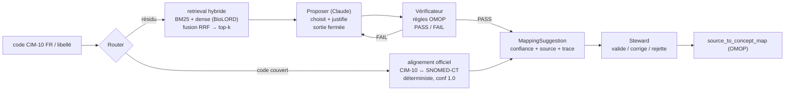

# governed-omop-rag

> **RAG agentique gouverné** pour le mapping de terminologies FR (**CIM-10 FR**,
> libellés cliniques) vers les **concepts standard OHDSI** (OMOP CDM), sous
> **supervision humaine** (human-in-the-loop).

[](https://github.com/behramkorkut/governed-omop-rag/actions/workflows/ci.yml)


> **Statut : fonctionnel de bout en bout, benchmark réel mesuré.** Corpus médaillon,
> retrieval hybride (BM25 + BioLORD), router déterministe + RAG agentique gouverné
> (Proposer + Vérificateur, LangGraph), API REST, UI Streamlit de revue steward,
> évaluation chiffrée sur **gold set réel ATIH/OHDSI** (Claude Sonnet 5 inclus),
> porte d'abstention, feedback. Suivi phase par phase :
> [`feature_list.json`](feature_list.json).

---

## Le problème

Un Entrepôt de Données de Santé français reçoit des codes en nomenclatures locales
(CIM-10 FR / ATIH, CCAM, NABM…) ou en texte libre. Pour faire de la recherche
reproductible multicentrique, il faut les **traduire vers les vocabulaires standard
OHDSI** (SNOMED-CT, RxNorm, LOINC…). Ce mapping est aujourd'hui **manuel et coûteux** ;
l'outil de référence (Usagi) fait du string-matching limité (~44 % sur certains cas).

## L'approche : hybride & gouvernée


```mermaid
flowchart LR
    IN["code CIM-10 FR / libellé"] --> R{Router}
    R -->|code couvert| OFF["alignement officiel<br/>CIM-10 ↔ SNOMED-CT<br/>déterministe, conf 1.0"]
    R -->|résidu| RET["retrieval hybride<br/>BM25 + dense (BioLORD)<br/>fusion RRF → top-k"]
    RET --> P["Proposer (Claude)<br/>choisit + justifie<br/>sortie fermée"]
    P --> V["Vérificateur<br/>règles OMOP<br/>PASS / FAIL"]
    V -->|FAIL| P
    V -->|PASS| S["MappingSuggestion<br/>confiance + source + trace"]
    OFF --> S
    S --> H["Steward<br/>valide / corrige / rejette"]
    H --> OUT["source_to_concept_map (OMOP)"]
```

On n'utilise l'IA **que là où elle apporte** : match officiel d'abord (gratuit,
fiable), RAG agentique **uniquement sur le résidu** (coût borné). L'agent
**propose**, le steward **dispose**. Sortie fermée = anti-hallucination structurel.

## Ce que l'outil résout et ce qu'il ne prétend pas résoudre

Le parti pris est assumé : **on ne prétend pas mapper 100 % des codes
automatiquement.** On mesure ce que chaque couche apporte, sur les **42 886 codes
CIM-10 FR** du vocabulaire OHDSI.

| Couche | Part des codes | Comment | Précision | Coût |
|---|---|---|---|---|
| Alignement officiel **1-à-1** (déterministe) | **31,8 %** | lookup ATIH/OHDSI « Maps to » univoque | 100 % (par construction) | 0, instantané |
| Officiellement mappé mais **ambigu** (1-à-plusieurs) | ~6,2 % | le RAG propose, le steward tranche | mesurée | LLM borné |
| **Sans mapping officiel** (rare, régional, non encodé) | ~62 % | retrieval sémantique + jugement LLM gouverné | mesurée | LLM borné |

Un **tiers** des codes est résolu gratuitement et sans erreur ; les **deux tiers
restants** — le vrai travail difficile — sont là où le RAG agentique gouverné propose
des candidats justifiés que l'humain valide. « Pas de mapping officiel » ne veut pas
dire « pas d'équivalent » : le RAG aide aussi à **découvrir** des correspondances non
encore encodées.

### Résultats mesurés et non pas estimés (gold set réel ATIH, 80 conditions, résidu held-out)

| Approche | Top-1 | recall@5 |
|---|---|---|
| baseline lexicale (proxy Usagi) | 0.325 | 0.487 |
| BM25 | 0.300 | 0.613 |
| BioLORD dense (sémantique seul) | 0.188 | 0.525 |
| **hybride BM25 + BioLORD (fusion RRF)** | **0.412** | **0.700** |
| **+ Proposer Claude Sonnet 5** (mapping final) | **0.650** | — |

Le retrieval hybride place le bon concept dans le **top-5 pour 70 %** du résidu ; le
jugement de Claude le choisit correctement **65 %** du temps (contre 41 % sans LLM),
pour **~0,005 $/code**. Détail complet, plancher, échecs, courbe d'abstention
(« savoir dire je ne sais pas ») : [`docs/evaluation.md`](docs/evaluation.md).

### Une brique, pas une révolution

L'outil de référence sur ce mapping (Usagi) fait du string-matching lexical. La
contribution ici est **méthodologique et d'ingénierie** : appliquer une architecture
**déterministe-d'abord → RAG agentique gouverné → human-in-the-loop** au mapping
CIM-10 FR → OMOP, et surtout **le mesurer** sur données réelles ATIH/OHDSI
avec plancher, échecs et coûts compris. C'est un **avancement relatif** et reproductible :
une base ouverte sur laquelle comparer, s'appuyer et contribuer. On ne dit pas que
c'est mieux ; on montre, chiffres à l'appui, **où** et **à quel coût** l'IA aide.

## S'inscrit dans un écosystème : le maillon manquant de `synthea-to-omop-fhir`

Ce projet ne vit pas isolé : il **comble un manque explicitement identifié** par un
projet amont, [`synthea-to-omop-fhir`](https://github.com/behramkorkut/synthea-to-omop-fhir)
(pipeline **Synthea → OMOP CDM → FHIR**, gouverné et souverain).

Ce pipeline amont construit fidèlement la structure OMOP en **préservant les codes
source**, mais isole le mapping vers les `concept_id` **standard** en une étape à part
— laissant des **`concept_id = 0`** pour les codes non mappés (avec une métrique de
couverture). Sa roadmap prévoyait justement un « *LLM/RAG concept-mapping assistant
(Usagi/Llettuce-style)* » pour combler ce trou, **non encore réalisé** de son côté.

**`governed-omop-rag` est cette brique.** Le `source_to_concept_map` validé par le
steward qu'il produit se **réinjecte** en amont pour remplacer les `concept_id = 0`
par des concepts standard. Deux projets, un seul contrat d'échange (table OMOP
standard), couplage minimal. Détail de la boucle : [`docs/reinjection.md`](docs/reinjection.md).

## Ce que ça démontre

- **RAG appliqué** : retrieval hybride (BM25 + embeddings biomédicaux) + fusion RRF,
  cache, évaluation `recall@k`.
- **Agents gouvernés** (principes Anthropic) : multi-agent **seulement là où
  justifié** (spécialisation + vérification), sortie fermée, boucle de correction
  bornée, context engineering.
- **Ingénierie data** : corpus **médaillon Bronze → Silver → Gold** (DuckDB).
- **Évaluation rigoureuse** : Top-1/recall@k, couverture, coût (tokens) & latence,
  baseline reproductible (proxy Usagi). « On ne dit pas que c'est mieux, on le mesure. »
- **Conformité & souveraineté** : embeddings locaux, Qdrant européen, IA Act,
  human-in-the-loop, données synthétiques.
- **Produit** : deux portes d'entrée (API REST + UI non-dev), packaging Docker, CI.

## Audit & qualité

Le projet a fait l'objet d'un **audit en deux passes** (revue de code +
**exécution réelle**, dont tests adversariaux sur chaque garde-fou), suivi de
corrections vérifiées une à une. 

| Garantie | Vérifiée à l'exécution |
|---|---|
| Anti-hallucination **structurel** : un `concept_id` hors candidats est rejeté **dans le code** (sortie fermée), pas seulement dans le prompt | ✅ par test dédié |
| Abstention « je ne sais pas » **incontournable** : portée par le router, identique quel que soit le point d'entrée (CLI, API, UI) et l'orchestrateur (simple / LangGraph) | ✅ par test dédié |
| Réponse LLM illisible ou API en panne → dégradation propre (`UNMAPPED` explicite), **un item cassé ne fait jamais échouer un lot** | ✅ par test dédié |
| Garde de coût API : quota par IP réelle (X-Forwarded-For honoré), fenêtre glissante, batch borné (HTTP 429 / 413) | ✅ par test dédié |
| **206 tests**, couverture mesurée ≈ 93 %, `mypy --strict`, `ruff` (lint + format) | ✅ CI verte |
| CI multi-version | ✅ Python **3.11 · 3.12 · 3.13** |

> Limite assumée et documentée : l'API de démo est **publique, sans
> authentification** (quota en mémoire par IP). Auth par clé + store partagé type
> Redis = marche suivante pour une mise en production.

## Observabilité : ce que coûte et ce que dure un mapping

L'architecture **borne le coût par conception** (router déterministe d'abord, LLM sur le
seul résidu, cache de retrieval). Restait une faiblesse : cette borne était une
*assertion d'architecture*, pas une mesure. Le tracing **Langfuse** la rend chiffrable.

### Ce qui est tracé, et pourquoi il a fallu deux mécanismes

| Mécanisme | Ce qu'il capture |
|---|---|
| `CallbackHandler` LangChain sur le `StateGraph` | structure du graphe, nœuds `propose` / `verify`, entrées-sorties, latence par nœud |
| Span `generation` explicite autour de l'appel Anthropic | modèle, prompt, réponse, **tokens et coût** |

Le second n'est pas redondant. Le Proposer appelle **directement** le SDK Anthropic
(`client.messages.create`), pas un modèle LangChain : le `CallbackHandler` ne le voit
donc pas. Sans ce span, les traces montrent le graphe mais **aucune donnée de coût** —
exactement ce qu'on cherchait à mesurer.

Les métadonnées de trace (`source_code`, `n_candidates`, `max_attempts`) rendent les
exécutions filtrables, notamment pour isoler les cas où le Vérificateur a rejeté et
forcé une reprise.

### Résultats mesurés (échantillon de 20 cas, `claude-sonnet-5`, 7 août 2026)

Gold set ATIH, résidu held-out, échantillon aléatoire **déterministe** (`--limit 20 --seed 42`) :
la mesure est rejouable à l'identique et comparable entre deux versions du pipeline.

| Indicateur | Valeur |
|---|---|
| Coût total (20 mappings) | **0,0749 $** |
| Coût moyen par mapping | **0,00374 $** |
| Coût extrapolé pour 1 000 mappings | ≈ **3,74 $** |
| Latence de l'appel LLM — p50 / p95 | **3,09 s** / **3,47 s** |
| Latence bout en bout | 3,59 s par entrée |
| Part de la latence imputable au LLM | **85 %** (retrieval + embedding : 15 %) |
| Tokens par entrée (entrée / sortie) | 1 534 / 68 — ratio **22,7×** |
| Appels LLM par cas | **1,00** (aucune reprise observée) |

Deux enseignements exploitables. Le **ratio entrée/sortie de 22,7×** montre que le coût
est dominé par le contexte envoyé (10 candidats détaillés) et non par la réponse :
réduire `top_k` ou élaguer les synonymes est le levier d'optimisation, pas raccourcir la
sortie. Et puisque **85 % de la latence est l'appel LLM**, optimiser le retrieval ne
rapporterait presque rien.

### Limites assumées de cette mesure

> **Cet échantillon ne valide pas la borne « un tiers traité gratuitement ».**
> Les 20 cas ont tous appelé le LLM — c'est attendu : le gold set ATIH **est** le résidu
> held-out, il ne contient par construction que des codes non couverts par l'alignement
> officiel. Le 31,8 % de résolution déterministe provient de l'analyse des 42 886 codes
> CIM-10 FR, une mesure distincte. Les deux ne doivent pas être confondues.

> **Le Top-1 de cet échantillon (0,600) ne remplace pas celui du gold set complet (0,650).**
> À n=20, l'intervalle de confiance à 95 % est [0,387 ; 0,781] — trop large pour conclure.
> Il recouvre celui des 80 cas ([0,541 ; 0,745]), donc les deux sont compatibles, mais
> **la performance se cite sur les 80 cas** ; l'échantillon de 20 sert au coût et à la latence,
> où il suffit largement.

> **Aucun rejet observé n'est pas un taux de rejet de 0 %.** Le Vérificateur n'a mordu sur
> aucun des 20 cas — cohérent avec une sortie fermée qui rend l'hallucination impossible
> en amont. C'est une absence d'observation, pas une statistique.

### Reproduire la mesure

```bash
uv sync --group dev --extra api --extra ui --extra agents --extra retrieval --extra observability
docker compose up -d qdrant

GOR_QDRANT_COLLECTION=ohdsi_biolord uv run gor eval-map \
  --gold-path data/eval/gold_set_atih.csv \
  --bronze-dir <repertoire_export_athena> \
  --domain Condition \
  --retriever hybrid --reuse-index \
  --limit 20
```

Le tracing est **optionnel et désactivé par défaut** (`GOR_LANGFUSE_ENABLED=false`) : sans
clés ni extra `observability`, il dégrade en no-op sans jamais faire échouer un mapping.
La suite de tests le neutralise explicitement (`tests/conftest.py`) — sinon les cas de
rejet simulés par `test_graph.py` pollueraient les mesures réelles.

## État des lieux

| Domaine | Statut |
|---|---|
| Corpus médaillon (Bronze/Silver/Gold, DuckDB) | ✅ |
| Retrieval hybride (BM25 + dense + RRF) + cache | ✅ |
| Router déterministe (alignement officiel) + RAG sur résidu | ✅ |
| Agents Proposer + Vérificateur (garde-fous, boucle bornée) | ✅ |
| Orchestration LangGraph (interchangeable) | ✅ |
| API REST (FastAPI) + UI steward (Streamlit) | ✅ |
| Export `source_to_concept_map` + feedback steward | ✅ |
| Évaluation (Top-k, couverture, coût/latence, baseline) | ✅ |
| Docs (architecture, gouvernance, souveraineté, IA Act) | ✅ |
| Gold set **réel** (ATIH) + benchmark chiffré (dont Claude Sonnet 5) | ✅ |
| Porte d'abstention (marge de retrieval, « je ne sais pas ») | ✅ |
| Expansion de requête · reranking cross-encoder | ⏳ (pistes d'amélioration) |

## Démarrage rapide

```bash
./init.sh                 # installe uv si absent, sync, smoke-test, tests
uv run gor smoke          # vérifie l'environnement

# Démo 100 % hors-ligne (ni Docker ni téléchargement de modèle) :
uv run gor map --source-label "diabète de type 2" --bronze-dir tests/fixtures \
  --embedding-backend hashing --vector-backend memory
```

Avec Docker (api + ui + qdrant) :

```bash
docker compose up --build         # UI: http://localhost:8501  ·  API: http://localhost:8000/docs
```

Copier `.env.example` en `.env` pour la configuration (clé Anthropic, URL Qdrant…).
Toutes les variables sont préfixées `GOR_`. Extras optionnels :
`uv sync --extra api --extra ui --extra agents --extra retrieval`.

## CLI (extrait)

```bash
gor map --source-label "asthme" ...            # mapping hybride (déterministe + RAG)
gor map ... --agent --engine langgraph         # via l'agent gouverné (LangGraph)
gor eval ... --retriever hybrid|bm25|dense|baseline   # recall@k, comparaison
gor eval-map ...                               # Top-1 / couverture / coût / latence
gor serve  ·  gor ui                           # API REST  ·  UI Streamlit
```

## Structure

```
src/governed_omop_rag/
├── medallion/   # corpus Bronze → Silver → Gold (DuckDB)
├── retrieval/   # embeddings, VectorStore (Qdrant/mémoire), BM25, RRF, cache
├── router/      # match officiel déterministe puis RAG sur le résidu
├── agents/      # Proposer + Vérificateur + orchestrateur (MappingAgent / LangGraph)
├── eval/        # gold set, Top-k, recall@k, métriques mapping, baseline
├── service.py   # pipeline complet, partagé par l'API et l'UI
├── api/         # FastAPI (/map, /map/batch)
├── ui/          # Streamlit (revue steward)
└── feedback.py  # journal des décisions steward (DuckDB)
```

## Documentation

- [Guide utilisateur (non-technique, FR)](docs/guide_utilisateur.md) — « essayez en 2 minutes »
- [Architecture](docs/architecture.md) — schéma mermaid + modules
- [Évaluation](docs/evaluation.md) — métriques, gold set, benchmark
- [Réinjection](docs/reinjection.md) — combler les `concept_id = 0` de `synthea-to-omop-fhir` (boucle amont)
- [Gouvernance](docs/governance.md) · [Souveraineté](docs/souverainete.md) · [Conformité IA Act](docs/ia_act.md)

## Gouvernance & conformité

Outil d'**aide à la décision** avec validation humaine. Données publiques/
synthétiques, sortie contrainte au vocabulaire réel, traçabilité complète,
**aucune décision clinique automatisée**. Détails :
[`docs/governance.md`](docs/governance.md), [`docs/ia_act.md`](docs/ia_act.md).

## Licence

MIT.
