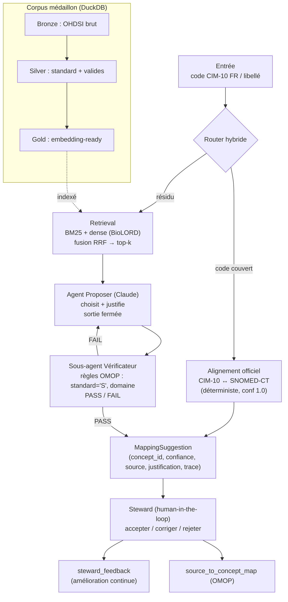

# Architecture

`governed-omop-rag` mappe des terminologies sources FR (CIM-10 FR, libellés) vers
les concepts standard OMOP, sous supervision humaine. Le pipeline est **hybride** :
match déterministe d'abord, RAG agentique **uniquement sur le résidu**.

## Vue d'ensemble

## Couches & modules

| Couche | Module | Rôle |
|---|---|---|
| Data (médaillon) | `medallion/` | Bronze → Silver → Gold sur DuckDB |
| Retrieval | `retrieval/` | embeddings (BioLORD/hashing), VectorStore (Qdrant/mémoire), BM25, fusion RRF, cache |
| Router | `router/` | déterministe (alignement officiel) + hybride (RAG sur résidu) |
| Agents | `agents/` | Proposer + Vérificateur + orchestrateur (MappingAgent / LangGraph) |
| Service | `service.py` | pipeline complet, **partagé** par l'API et l'UI |
| Exposition | `api/`, `ui/` | FastAPI (`/map`, `/map/batch`) et Streamlit (revue steward) |
| Évaluation | `eval/` | gold set, Top-k, recall@k, métriques mapping, baseline |
| Feedback | `feedback.py` | journal des décisions steward (DuckDB) |

## Principes agentiques (Anthropic)

- **Multi-agent seulement là où justifié** : spécialisation (Proposer vs
  Vérificateur) et vérification. Le retrieval reste **déterministe**.
- **Sortie fermée** : le Proposer ne peut retourner qu'un `concept_id` de la liste
  → anti-hallucination structurel.
- **Boucle de correction bornée** : Proposer ↔ Vérificateur, `max_attempts`.
- **Context engineering** : on n'injecte que le top-k reclassé, pas tout le vocabulaire.
- **Coût borné** : le LLM ne voit que le résidu (pas les cas couverts par l'officiel).

Deux runtimes d'orchestration interchangeables : `MappingAgent` (simple) et
`LangGraphMappingAgent` (StateGraph), derrière le même protocole `Agent`.
