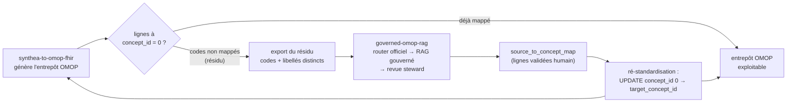

# Réinjection : combler les `concept_id = 0` de `synthea-to-omop-fhir`

> Comment le `source_to_concept_map` validé par les stewards (produit ici) est
> réutilisé en amont pour remplacer les `concept_id = 0` (codes non mappés) dans
> l'entrepôt OMOP généré par
> [`synthea-to-omop-fhir`](https://github.com/behramkorkut/synthea-to-omop-fhir).

> **Ce projet réalise une extension planifiée du pipeline amont.** La roadmap de
> `synthea-to-omop-fhir` prévoit un « *LLM/RAG concept-mapping assistant
> (Usagi/Llettuce-style)* » pour **combler le trou `concept_id = 0`**, non encore
> réalisé de son côté. `governed-omop-rag` **est** cette brique.

---

## 1. Le problème amont

[`synthea-to-omop-fhir`](https://github.com/behramkorkut/synthea-to-omop-fhir)
transforme des données patient (Synthea → **OMOP CDM** → FHIR). Il construit la
structure OMOP en **préservant les codes source**, mais isole le mapping vers les
`concept_id` **standard OHDSI** (`standard_concept = 'S'`) en une **étape à part**
(vocabulaire OHDSI / Athena), avec une métrique de couverture.

Quand un code source n'a **aucune correspondance** connue — nomenclature locale
(CIM-10 FR / ATIH), libellé en texte libre, code absent des tables d'alignement
officielles — le pipeline écrit la valeur sentinelle **`concept_id = 0`** (« No matching concept »).

Ces `concept_id = 0` sont le **résidu** : ils cassent la comparabilité
multicentrique (une cohorte OMOP sur SNOMED ne « voit » pas les lignes à 0) et
doivent être résolus à la main. C'est exactement le résidu que
`governed-omop-rag` traite : match officiel d'abord, RAG agentique gouverné sur
ce qui reste, validation humaine.

## 2. Le contrat d'échange : `source_to_concept_map` (STCM)

La sortie de `governed-omop-rag` est une table **OMOP native**, standard et non
propriétaire : `source_to_concept_map` (STCM). Elle est produite par
l'export après validation steward (cf. [`docs/guide_utilisateur.md`](guide_utilisateur.md)
et `gor` / l'UI Streamlit) et **ne contient que des lignes validées ou corrigées
par un humain** — jamais une suggestion brute de l'agent.

Colonnes clés (schéma OMOP CDM) :

| Colonne | Rôle |
|---|---|
| `source_code` | code d'origine (ex. code CIM-10 FR, ou un identifiant de libellé libre) |
| `source_vocabulary_id` | vocabulaire source (ex. `ICD10_FR`) |
| `source_code_description` | libellé source lisible |
| `target_concept_id` | **concept standard OHDSI retenu** (SNOMED/RxNorm/LOINC…), `standard_concept = 'S'` |
| `target_vocabulary_id` | vocabulaire cible (ex. `SNOMED`) |
| `valid_start_date` / `valid_end_date` | fenêtre de validité du mapping |
| `invalid_reason` | `NULL` = actif |

Le couplage est **volontairement faible** : deux dépôts indépendants qui
s'échangent un **fichier CSV/table au format OMOP**. `governed-omop-rag`
n'importe rien de `synthea-to-omop-fhir` et réciproquement — pas de dépendance
de code, pas d'API partagée. Le seul contrat est le schéma STCM.

## 3. La boucle de bout en bout



Étapes :

1. **Détecter le résidu.** Dans l'entrepôt OMOP produit en amont, lister les
   couples `(source_code, source_vocabulary_id, source_code_description)` distincts
   dont le `concept_id` standardisé vaut `0`.
2. **Mapper le résidu.** Passer ces codes/libellés dans `governed-omop-rag`
   (batch via l'API `/map/batch`, ou l'UI Streamlit pour la revue). Le router
   résout d'abord ce qui est couvert par l'alignement officiel ; seul le reste
   part vers le RAG agentique.
3. **Valider (humain).** Le steward accepte / corrige / rejette chaque
   suggestion. Rien n'est exporté sans décision humaine.
4. **Exporter le STCM.** L'export produit `source_to_concept_map.csv` (lignes
   validées uniquement).
5. **Ré-standardiser en amont.** Charger le STCM dans l'entrepôt OMOP et
   remplacer les `concept_id = 0` par le `target_concept_id` correspondant.
6. **Boucler.** Au prochain run, le résidu a diminué ; les nouveaux codes non
   couverts repartent dans la boucle.

## 4. Comment réinjecter concrètement

### 4.1 Extraire le résidu (côté entrepôt amont)

Les colonnes `*_source_value` conservent le code d'origine à côté du
`*_concept_id` standardisé. Exemple sur `condition_occurrence` :

```sql
-- Codes source distincts restés non standardisés (concept_id = 0)
SELECT DISTINCT
    condition_source_value          AS source_code,
    'ICD10_FR'                      AS source_vocabulary_id,
    condition_source_value          AS source_code_description
FROM condition_occurrence
WHERE condition_concept_id = 0
  AND condition_source_value IS NOT NULL;
```

(Le même motif s'applique aux autres domaines : `drug_source_value` sur
`drug_exposure`, `measurement_source_value` sur `measurement`, etc.)

Export en CSV → entrée de `governed-omop-rag` (colonnes attendues : au minimum
un code source **ou** un libellé ; cf. `data/examples/exemple_entrees.csv`).

### 4.2 Produire le STCM validé (côté `governed-omop-rag`)

Voir le [guide utilisateur](guide_utilisateur.md). En bref :

```bash
# Mapping batch hors-ligne pour l'exemple ; en réel : backends dense + Qdrant
uv run gor map --source-label "…"        # ligne à ligne
# ou l'UI de revue steward :
uv run gor ui                            # import CSV → revue → export STCM
```

L'export livre `source_to_concept_map.csv` au schéma OMOP (§2).

### 4.3 Appliquer le STCM (retour côté entrepôt amont)

Charger le STCM puis ré-standardiser les lignes à 0. Exemple DuckDB / SQL
ANSI sur `condition_occurrence` :

```sql
-- 1) charger le mapping validé
CREATE TABLE source_to_concept_map AS
    SELECT * FROM read_csv_auto('source_to_concept_map.csv');

-- 2) remplacer les concept_id = 0 par le concept standard validé
UPDATE condition_occurrence AS c
SET condition_concept_id = m.target_concept_id
FROM source_to_concept_map AS m
WHERE c.condition_concept_id = 0
  AND c.condition_source_value = m.source_code
  AND m.source_vocabulary_id  = 'ICD10_FR'
  AND m.invalid_reason IS NULL;
```

Après application, recompter les `concept_id = 0` : le taux de couverture doit
monter. C'est la même métrique de **couverture** que celle mesurée dans
[`docs/evaluation.md`](evaluation.md).

## 5. Garanties de gouvernance dans la boucle

- **Rien d'automatique côté clinique.** Seules des lignes validées par un
  humain entrent dans le STCM ; la réinjection ne fait que recopier ces
  décisions. L'agent ne modifie jamais l'entrepôt amont directement.
- **Sortie fermée.** `target_concept_id` provient toujours d'un concept réel du
  référentiel OHDSI (`standard_concept = 'S'`) — pas d'ID inventé (anti-hallucination
  structurel, cf. [`docs/governance.md`](governance.md)).
- **Traçabilité.** Chaque ligne STCM porte sa source (`official_map` vs RAG),
  ses dates de validité et le feedback steward journalisé
  (`feedback.py`). La réinjection est donc auditable et réversible.
- **Idempotence.** Rejouer la réinjection avec le même STCM ne change rien (les
  `concept_id` déjà résolus ne valent plus 0) ; on peut la relancer sans risque.
- **Découplage.** Le format d'échange étant du STCM OMOP standard, n'importe
  quel pipeline (pas seulement `synthea-to-omop-fhir`) peut consommer la sortie.

## 6. Résumé

`synthea-to-omop-fhir` **produit le problème** (les `concept_id = 0`),
`governed-omop-rag` **produit la solution gouvernée** (un `source_to_concept_map`
validé par des humains), et la réinjection **referme la boucle** par un simple
`UPDATE` idempotent. Le seul contrat entre les deux projets est une table OMOP
standard — couplage minimal, gouvernance maximale.
